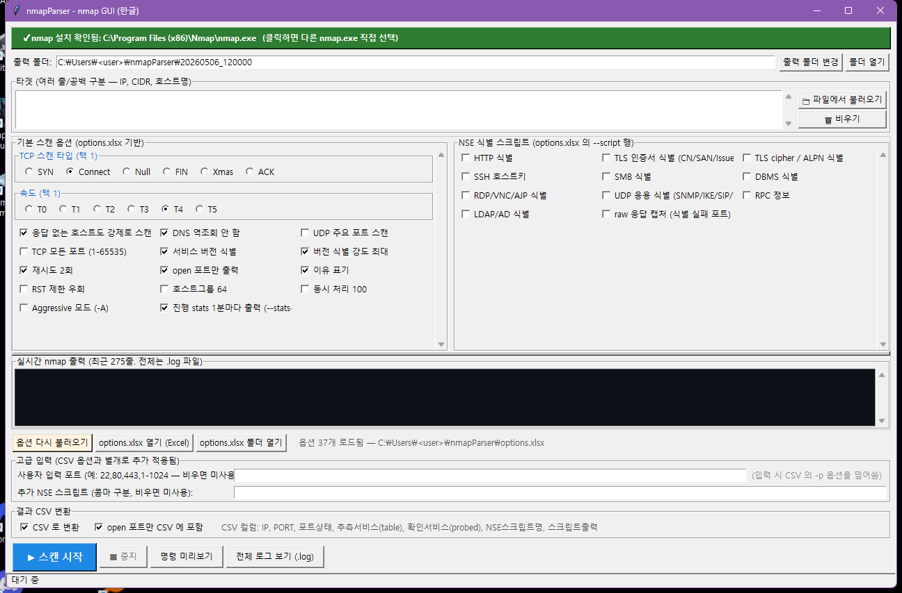
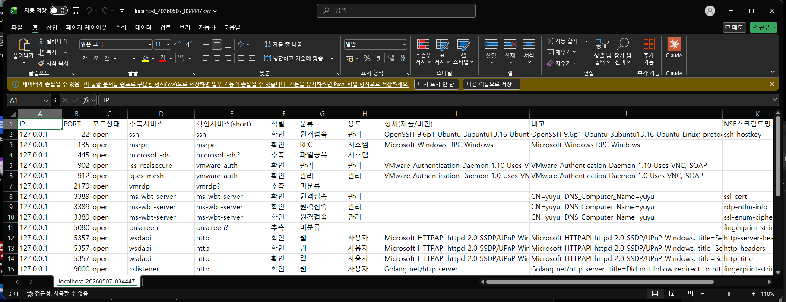

# nmapParser

> **비기술 점검자/관리자용 nmap GUI** — 한국어 라벨, Excel 로 옵션 관리, CSV 결과는 분류·식별·비고가 자동 채워져 그대로 보고서 베이스로 쓸 수 있습니다.

🇬🇧 *English version: [README.en.md](./README.en.md)*



---

## 30초 요약

1. **타깃 입력 → ▶ 스캔 시작.** GUI default 가 사용자 점검 표준 (`phase1`) 명령을 그대로 조립합니다.
2. **결과 CSV 12컬럼.** Excel 로 열어 `분류`/`용도`/`식별` 필터만 걸어도 90% 정리 끝.
3. **옵션은 Excel 로 관리.** `options.xlsx` / `categories.xlsx` 행 추가만 하면 GUI 가 바로 반영.



## 빠른 시작

**Option A — `.exe` 한 파일 (Python 불필요)**
1. nmap 설치: <https://nmap.org/download.html>
2. [Releases](https://github.com/patissierMongs/nmapParser/releases/latest) 에서 `nmapParser.exe` 다운로드
3. 더블클릭. 첫 실행 시 `options.xlsx` / `categories.xlsx` 자동 생성

**Option B — 소스에서**
```
git clone https://github.com/patissierMongs/nmapParser.git
cd nmapParser
python nmapParser.py    # 또는 nmapParser.bat
```

## 핵심 기능

- **한국어 GUI + 옵션마다 hover 툴팁.**
- **체크박스 + 라디오 그룹** (TCP 스캔 타입 / 속도 — 같은 그룹 = 택1).
- **`phase1` 표준 명령 default.** SYN+버전식별+UDP 26포트+NSE 19개 한 번에.
- **다중 `-p` 자동 합치기.** TCP 풀 + UDP 행 둘 다 켜도 단일 `-p T:...,U:...`.
- **실시간 로그** (최근 275줄 화면 / 전체는 `.log` 파일) + `--stats-every 1m` 자동 추가로 buffer 멈춤 방지.
- **창 닫기 시 nmap 자동 종료** (좀비 프로세스 방지).

## CSV 12컬럼

| 컬럼 | 의미 |
|---|---|
| IP, PORT, 포트상태 | nmap 기본 |
| **추측서비스** | 포트번호 룩업 (`nmap-services`) |
| **확인서비스(short)** | XML `<service>@name`. probe 실패 시 `?` |
| **식별** | `확인` / `추측` / `tcpwrapped` / `미확인` 4값 |
| **분류** | `웹` / `원격접속` / `DBMS` / `RPC` / ... (categories.xlsx) |
| **용도** | `관리` / `사용자` / `시스템` / `모니터링` / ... |
| **상세(제품/버전)** | `OpenSSH 9.6p1 Ubuntu...` 등 verbose |
| **비고** | 자동 요약 한 줄 — detail + NSE 핵심 (CN, OS, hostname, title) |
| NSE스크립트명, 스크립트출력 | NSE raw 결과 |

> **이 도구는 관찰까지.** 우선순위·노출 평가·권고 같은 판단은 의도적으로 생성하지 않습니다 — 사람의 영역.

### 두 컬럼 비교가 핵심
- 22000번 포트 추측서비스 = `snapenetio` 인데 확인서비스(short) = `ssh` 라면 → 추측이 틀렸음.
- 확인서비스(short) 가 `microsoft-ds?` 처럼 `?` 로 끝나면 → probe 시도했지만 실패. **추측만 가지고 판단 금지** 의 신호.

## Excel 로 옵션 관리

GUI 의 `options.xlsx 열기 (Excel)` → 행 추가/편집 → 저장 → `옵션 다시 불러오기` 클릭.

| 파일 | 컬럼 | 용도 |
|---|---|---|
| `options.xlsx` | 스캔 옵션 / 옵션 / 활성화 / 그룹 / 상세설명 | 체크박스/라디오/툴팁 |
| `categories.xlsx` | 서비스명 / 분류 / 용도 / 설명 | CSV 의 `분류` / `용도` 자동 채움 (~95 항목 기본 동봉) |

## 기준 명령 (`phase1`)

GUI default 만으로 정확히 이 명령이 조립됩니다 — 타깃 입력 후 ▶ 클릭:

```
nmap -Pn -n -sS -sU -sV --version-all \
     -p T:1-65535,U:7,53,67,68,69,88,123,135,137,138,139,161,162,389,400,500,514,520,623,1900,2049,4500,5060,5353,5355,11211 \
     --min-hostgroup 64 --max-parallelism 100 \
     --script 'http-headers,http-server-header,http-title,ssh-hostkey,
               ssl-cert,ssl-enum-ciphers,tls-alpn,
               ms-sql-info,oracle-tns-version,rdp-ntlm-info,
               snmp-info,ike-version,sip-methods,ntp-info,
               nbstat,smb-os-discovery,smb-protocols,rpcinfo,
               fingerprint-strings' \
     -T4 --max-retries 2 --reason --open --defeat-rst-ratelimit \
     -oA phase1 <대역>
```

## 변경 이력

<details>
<summary><b>v0.2 — 안정성 (현재)</b></summary>

- 좀비 nmap 방지 (창 닫기 시 자식 프로세스 정리)
- 스캔 중지 시 친절 popup (XML ParseError 안 뜸)
- 다중 `-p` 자동 합치기
- xlsx XML invalid control char sanitize
- IP octet 검증 (`192.168.1.999` 거부)
- styles.xml OOXML strict 준수 (openpyxl 경고 0)
- CSV 에 식별/비고 컬럼 추가 (12컬럼)
</details>

<details>
<summary><b>v0.1 — 첫 릴리즈</b></summary>

- Windows 단독 실행 `.exe` (PyInstaller, ~10.7 MB)
- 10컬럼 CSV (IP/PORT/포트상태/추측·확인서비스/분류/용도/상세/NSE)
- options.xlsx 5컬럼 + categories.xlsx 4컬럼 Excel 편집
- 라디오 그룹 + 체크박스 grid + 한국어 툴팁
</details>

## 한계

- `-sS` 는 관리자 권한 필요. 일반 사용자는 라디오에서 `Connect` 선택.
- 구버전 nmap 에 없는 NSE 는 nmap 이 무시 또는 경고만.
- IPv6-only 호스트는 CSV `IP` 컬럼에 IPv6 주소 그대로.

## 라이선스 / 만든 사람

MIT — [LICENSE](./LICENSE) · [@patissierMongs](https://github.com/patissierMongs)
